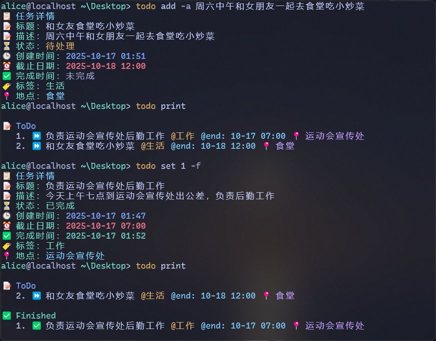

# todo-ai

`todo-ai` 是一个带有 LLM 增强能力的命令行待办事项工具，支持本地 JSON 持久化存储、彩色终端展示以及通过自然语言自动生成结构化任务。

## 界面展示




## 功能亮点
- 自然语言转任务：结合可配置的 API（模型、Key、Base URL）自动提取标题、截止时间、标签等字段。
- 结构化管理：支持新增、查看、修改、删除、归档等常见待办操作，自动维护 JSON 数据文件。
- 终端友好显示：彩色分组展示任务状态，快速区分进行中、已完成与逾期事项。
- 持久化与归档：将活跃任务保存在 `todo.json`，已完成任务逐行归档到 `archive.json`，支持后续统计。
- 跨平台：默认数据路径位于 `~/.local/share/td/`，兼容常见桌面操作系统。

## 环境准备
1. **Python 版本**：3.8 及以上。
2. **克隆仓库**：
   ```bash
   git clone <your-fork-or-clone-url>
   cd todo-ai
   ```
3. **创建并激活虚拟环境（推荐）**：
   ```bash
   python -m venv .venv
   .venv\Scripts\activate  # PowerShell
   ```
4. **安装依赖与命令行入口**：
   ```bash
   pip install -e .
   ```
   安装完成后会注册 `todo` 命令。

## 快速开始
1. **首次运行自动初始化存储目录**：
   ```bash
   todo help
   ```
2. **配置能力模型（可选，但 `--auto` 模式需要）**：
   ```bash
   todo config -k <API_KEY> -m <MODEL_ID> -a <BASE_URL>
   ```
   - `-k/--key`：接口密钥。
   - `-m/--model`：模型名称或 ID。
   - `-a/--api_url`：兼容 OpenAI Chat Completions 的 HTTP 接口地址。

## 命令速查
| 命令 | 说明 | 常用参数 |
| --- | --- | --- |
| `todo add <title>` | 新建任务；可选自动解析 | `-a/--auto` 自动解析自然语言<br>`-d/--deadline` 指定截止时间（`YYYY-MM-DD HH:MM` 或自然语言，需配合 `--auto`）<br>`-t/--tags` 设置标签<br>`-des/--description` 添加描述 |
| `todo print [id]` | 查看全部或指定序号的任务 | `id` 从 1 开始；留空则分组展示全部 |
| `todo set <id>` | 修改任务 | `-f/--finish` 标记完成并写入完成时间<br>`-t/--title`、`-d/--deadline`、`-de/--description`、`-l/--location`、`-ta/--tags`<br>`-r/--remove` 删除该任务 |
| `todo archive [id]` | 归档全部已完成任务或查看某归档项 | 留空执行归档并展示摘要；指定 `id` 查看单条已完成任务 |
| `todo config` | 查看/更新配置 | `-k/--key`、`-m/--model`、`-a/--api_url` |
| `todo help` | 查看内置帮助 | 无 |

### 示例
```bash
# 手动添加任务
todo add "整理项目需求" -d "2025-10-20 18:00" -t "工作" -des "汇总客户反馈"

# 自动解析生成任务
todo add "明天下午三点在图书馆完成数学作业" --auto

# 标记任务完成
todo set 1 --finish

# 归档所有已完成任务
todo archive
```

## 数据与配置存放位置
- 活跃待办：`~/.local/share/td/todo.json`
- 归档记录：`~/.local/share/td/archive.json`
- 配置信息：`~/.local/share/td/config.ini`

在 Windows 下路径示例：`C:\Users\<用户名>\.local\share\td\todo.json`。

## 常见问题
- **API 请求失败**：确认 `todo config` 中的 Key、模型 ID 与 Base URL 均已设置且接口兼容 OpenAI Chat Completions 协议。
- **终端乱码或颜色异常**：确保终端支持 ANSI 颜色（Windows 10+ PowerShell 默认支持）。
- **时间解析失败**：`--auto` 模式依赖后端模型遵循提示词，请检查模型是否按要求返回纯 JSON。

## 更多文档
- 离线使用手册：打开 `docs/help.html`
- 项目结构与源码：`todo/` 目录

欢迎根据需求扩展命令或集成更多服务。
